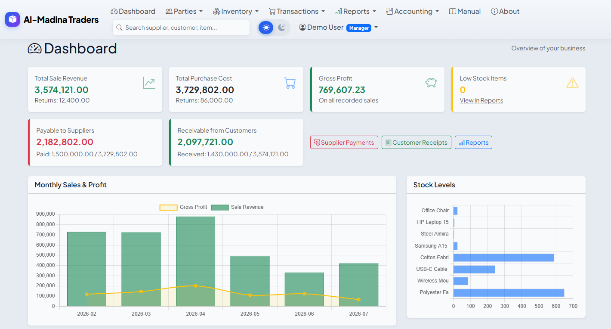
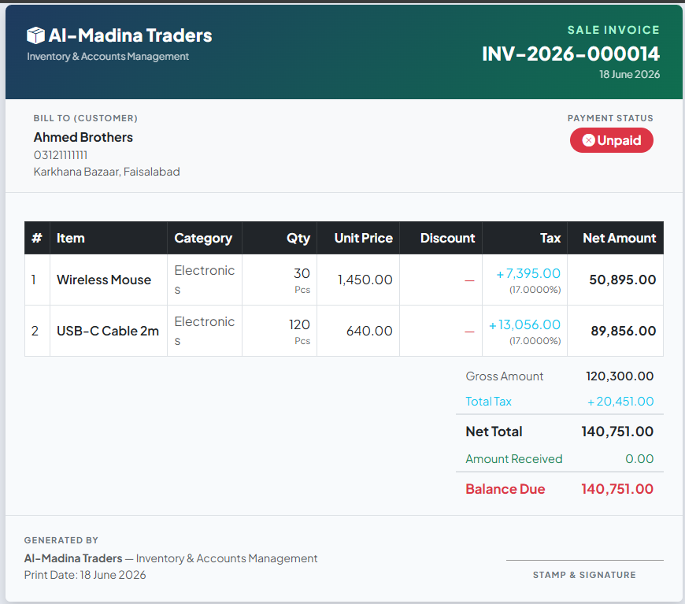
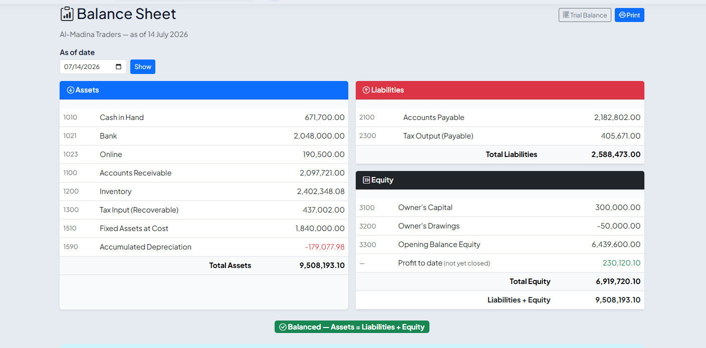
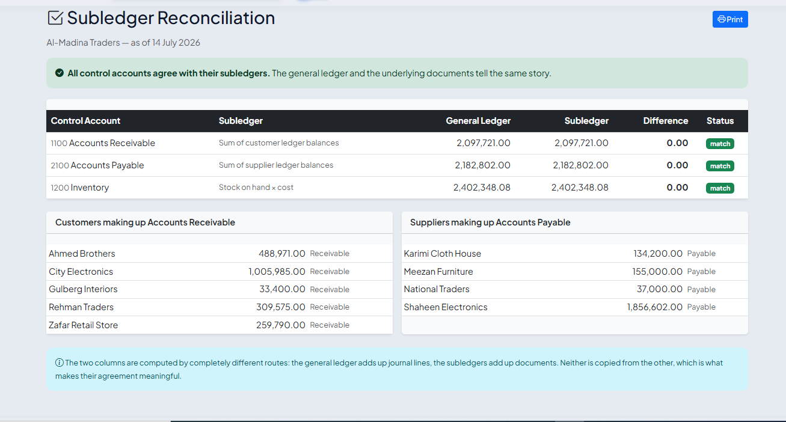

# TradeFlow — Inventory & Double-Entry Accounting

**Inventory software keeps your stock in one place and your accounts in another, and quietly lets them disagree. Then the books don't balance and nobody can tell you why.**

TradeFlow doesn't. Every purchase, sale, return, payment, expense and depreciation charge is posted into a real **double-entry general ledger** the moment it is saved. The Balance Sheet, the Profit & Loss, the stock report and the cash flow statement are all summed from the same books — so they always agree, and there is a report that proves it.

A full trading and accounting system: stock at weighted-average cost, receivables and payables with control accounts, a fixed asset register with depreciation, gapless invoice numbering, accounting periods and year-end closing. The kind of thing you are told to buy a licence for.

### 🔗 [Live demo](https://tradeflow-demo.onrender.com) — `demo@demo.com` / `demo1234`

> First load takes ~40 seconds — free hosting, the server sleeps when idle. After that it's instant.

---

## Screenshots

| Dashboard | Sale Invoice |
|---|---|
|  |  |

| Balance Sheet | Reconciliation |
|---|---|
|  |  |

---

## What it does

**Trading**
- Suppliers & customers with opening balances, running ledgers, statements and ageing
- Multi-line purchase & sale invoices, with per-line discount and tax
- Purchase returns, sale returns, quotations, purchase orders, delivery challans
- Printable invoices (a reversed one prints with a REVERSED watermark)

**Inventory**
- Items, categories, reorder alerts, stock adjustments
- **Weighted-average costing** — profit is computed at the moment of sale, not by a month-end guess

**Money**
- Any number of cash and bank accounts; every payment, receipt and expense belongs to one
- Supplier payments, customer receipts, expenses by category

**Accounting**
- Double-entry general ledger, chart of accounts, manual journal entries
- Accounting periods, fiscal years, **year-end closing** into Retained Earnings
- **Fixed assets** — straight-line and reducing-balance depreciation, posted monthly; disposal with gain/loss
- **Gapless invoice numbering**, reset each fiscal year

**Reports**
- Balance Sheet · Profit & Loss · Trial Balance · Cash Flow Statement
- Stock Valuation · AP/AR Ageing · Cash Book · GST Summary
- **Reconciliation** — the one that proves the rest

**Operations**
- Roles (staff / manager / admin), audit log of every change, rate-limited sign-in
- One-file backup and restore, on either database engine
- Light & dark themes; user manual built in, in **English and Roman Urdu**

---

## What makes it different

An accounting system earns its keep by what it **refuses** to do.

| Rule | Why |
|---|---|
| **A posted document is never edited or deleted — it is reversed.** | The original stays, marked reversed, with a cancelling journal entry beside it. That is what an audit trail *is*. |
| **Invoice numbers have no gaps.** | Numbers come from a counter that rolls back with the transaction, so a failed save never burns one. A numbered invoice cannot be deleted, only reversed — keeping its number. |
| **Stock can never go negative.** | Not by selling, not by adjusting, and not by reversing a purchase whose goods have already been sold — the case everybody forgets. |
| **Control accounts belong to their subledgers.** | Receivables, Payables and Inventory cannot be touched by a manual journal entry. They move only when a document moves them — which is why they always agree with the customer, supplier and stock ledgers. |
| **Nothing posts into a closed period.** | Figures you have already reported cannot quietly change underneath you. |

### The books prove themselves

Four checks, each comparing two records kept independently of each other:

- **Balance Sheet** — Assets = Liabilities + Equity. Equity is *not* a balancing figure here; it is added up on its own, so the two sides matching is a **result**, not an arrangement.
- **Trial Balance** — total debits = total credits.
- **Reconciliation** — Receivables, Payables and Inventory in the ledger = the customer, supplier and stock ledgers underneath them.
- **Cash Flow** — opening cash + movement = closing cash, and that figure equals the Cash & Bank page and the Balance Sheet.

Run them and they either all agree or they do not. There is no third answer, and no report that can be made to look right on its own.

---

## Tech

Python · Flask · SQLAlchemy · Bootstrap 5 · PostgreSQL or SQLite · Gunicorn

- Exact-decimal money (`Numeric(14,4)`) — no floating-point cents
- Row-level locking on stock, so two simultaneous sales cannot oversell the same item
- CSRF protection, argon2 password hashing, security headers, DB-backed rate limiting
- **82 tests**, run on every push (GitHub Actions)

---

## Run it locally

```bash
python -m venv venv
venv\Scripts\activate            # Windows  (source venv/bin/activate on Mac/Linux)
pip install -r requirements.txt

copy .env.example .env           # then fill in SECRET_KEY and SECURITY_PASSWORD_SALT
flask create-user                # your admin login
python app.py                    # http://127.0.0.1:5172
```

Want a company with a year of trading behind it, to look around in?

```bash
flask seed-data --yes
```

It builds suppliers, customers, items, invoices, payments, returns, fixed assets and a full ledger — then **checks its own work**: debits equal credits, and the ledger agrees with every subledger, before it tells you it is done.

---

## Deploy

Runs on any host that supports Python. On Render:

| | |
|---|---|
| Build | `pip install -r requirements.txt` |
| Start | `gunicorn app:app` |

Set `DATABASE_URL` to a PostgreSQL connection string, plus `SECRET_KEY` and `SECURITY_PASSWORD_SALT`. Schema migrations run automatically on boot.

Three settings decide how the books behave, and they should be right **before any data is entered**:

| | |
|---|---|
| `APP_TIMEZONE` | The business's own clock — `Asia/Karachi`, `Asia/Dubai`, `Europe/London`, `America/New_York`. Every business date is written on it, not on the server's. |
| `FISCAL_YEAR_START_MONTH` | `1` (UAE, US), `7` (Pakistan), `4` (UK, India). Decides which accounting periods exist. |
| `CURRENCY` | `Rs`, `£`, `$`, `AED`. Shown, never converted. |

---

## Not included

Said plainly, because finding out later is worse:

- **FIFO / LIFO costing** — stock is weighted average
- **Multiple currencies**
- **Multiple companies** — one set of books per installation
- Budgets, cost centres, recurring entries

---

## Need this for your business?

I build custom inventory and accounting systems. If you want this adapted to how you actually trade, or something built from scratch, get in touch.

**Sabir Shah** — [sabir1212@yahoo.com](mailto:sabir1212@yahoo.com) · WhatsApp +92 332 279 9582
